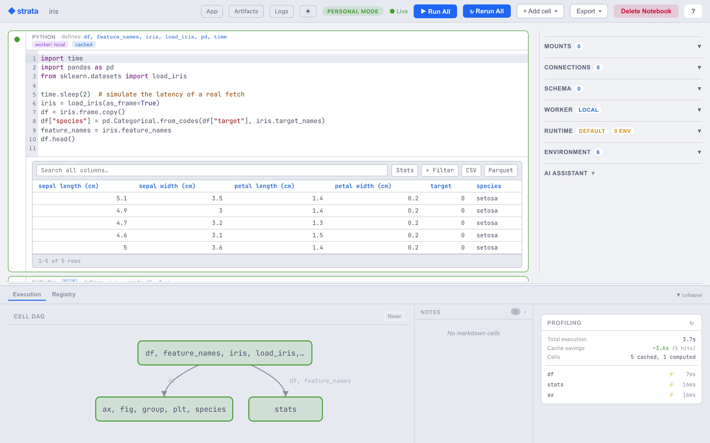

# Strata

[](https://pypi.org/project/strata-notebook/)
[](https://pypi.org/project/strata-notebook/)
[](https://github.com/bearing-research/strata/blob/main/LICENSE)
[](https://github.com/bearing-research/strata/actions/workflows/ci.yml)
[](https://github.com/bearing-research/strata/actions/workflows/pre-commit.yml)
[](https://github.com/bearing-research/strata/actions/workflows/docker.yml)
[](https://github.com/bearing-research/strata/actions/workflows/docs.yml)
[](https://codecov.io/gh/bearing-research/strata)
[](https://securityscorecards.dev/viewer/?uri=github.com/bearing-research/strata)

**Strata is a content-addressed computation graph with an interactive notebook UI.**

Every cell output is a versioned artifact keyed by its provenance: source,
inputs, and environment. Strata reads each cell's AST to build the
dependency graph automatically, so re-running a notebook is mostly a series
of cache hits. Touch one cell and the cascade re-executes only the cells
that depend on it. Identical inputs produce the same artifact whether the
second run comes a minute later or a year later, on the same machine or a
different one.

Prompt cells make AI calls first-class DAG nodes, cached by template,
inputs, and model config. `# @worker gpu-fly` dispatches a cell to a remote
GPU. `# @mount data s3://bucket/prefix ro` makes an S3 prefix available as a
local `pathlib.Path` inside the cell. The whole notebook is plain `.py`
files plus a manifest, so commits are git-diffable and there are no JSON
blobs or execution metadata bleeding into the history.

<picture>
  <source media="(prefers-color-scheme: dark)" srcset="docs/assets/notebook-anatomy-dark.png">
  
</picture>

**Docs:** [bearing-research.github.io/strata](https://bearing-research.github.io/strata/)

## Give your coding agent a cached scratchpad

Coding agents explore by writing throwaway `python -c` and `/tmp` scripts:
invisible, uncached, redone every session. Point one at Strata instead and it
uses a **persistent, cached notebook** as its scratchpad: every snippet becomes a
content-addressed cell, so the expensive step it ran ten turns ago is still a
cache hit now, a human can watch it work live, and the work is a git-diffable
directory instead of discarded scripts.

Install it as a one-command [Claude Code plugin](plugins/strata-scratchpad/)
(needs the `strata` CLI on `PATH`; `uv tool install strata-notebook`):

```
/plugin marketplace add bearing-research/strata
/plugin install strata-scratchpad@strata
```

<!-- Demo GIF slot. Record with examples/agent_demo/RECORDING.md, save to
     docs/assets/agent-demo.gif, then uncomment the line below:

-->

Whether an agent reaches for it instead of a scratch script is measured rather
than assumed. `evals/agent_notebook/` drives the real on-ramp and grades the
result: 9 transcript-backed tasks run in CI, and a `scratchpad` group probes
whether an un-primed session uses the notebook at all. See
[Driving a notebook with a coding agent](https://bearing-research.github.io/strata/latest/notebook/agent/).

## Highlights

**The graph**

- **content-addressed:** every cell output is keyed by source + inputs + environment, so identical work hits the cache forever
- **reactive:** edit a cell and the cascade re-runs only what depends on it
- **dag-from-ast:** Strata reads each cell's AST to wire upstream and downstream, with no decorators and no manual edges
- **git-friendly:** notebooks are plain `.py` files plus a TOML manifest, so diffs are readable
- **dag view:** the dependency graph renders alongside the cells; double-click a node to jump to its source

**Cell types**

- **prompt cells:** LLM calls as DAG nodes, `{{ variable }}` interpolation from upstream, cached by template + inputs + model config
- **SQL cells:** named connections and bind-parameter templating, with drivers for DuckDB, SQLite, Postgres, Snowflake and BigQuery
- **R cells:** Python and R share one DAG, exchanging Arrow, so a `pandas.DataFrame` is a `data.frame` for the next cell
- **loop cells:** `# @loop max_iter=N carry=state` iterates with an explicit carry, each step its own artifact
- **variant sweeps:** run every variant of a group and hand the downstream cell a `{name: value}` dict, or fan out with `# @per_variant` so adding a variant only runs the new one
- **widget cells:** declarative controls that downstream cells consume as inputs; with Live on, dragging one recomputes what depends on it
- **cell unit tests:** a Tests panel runs real pytest against a cell's defs and upstream inputs, doubling as a health badge

**Coding agents**

- **scratchpad plugin:** a Claude Code plugin makes an agent use a cached notebook cell for throwaway Python instead of `/tmp` scripts
- **MCP server:** expose a warm notebook session to any MCP client at `/mcp`, and watch it work in the browser or the terminal
- **agent CLI:** `strata` inspects, runs and authors a notebook with `--format json` and stable exit codes, offline or against a live session
- **one-command on-ramp:** `strata agent ./nb` stands up the server, session, config and viewer in one step

**Compute and data**

- **distributed:** `# @worker gpu-fly` dispatches a cell to a remote box; bring your own compute
- **remote cells over SSH:** hand an agent an SSH target and it provisions a worker there, tunnels to it, and routes heavy cells over, cached like everything else
- **mounts:** `# @mount data s3://bucket/prefix ro` makes any S3, GCS or Azure prefix a local `pathlib.Path`
- **isolated envs:** every notebook gets its own uv-managed `.venv/`, locked and reproducible
- **headless:** `strata run ./my-notebook` for CI and scheduled execution, same DAG and same cache

**Surfaces**

- **terminal viewer:** `strata watch` renders a running notebook live in the terminal, read-only, over SSH or beside your editor
- **app view:** open a notebook as a read-only app, embed it as an `<iframe>`, or export a self-contained snapshot
- **data viewer:** DataFrame outputs render in a grid you can page, sort, filter and search, backed by the full artifact rather than a preview
- **also a library:** `pip install strata-client` talks to the store from any pipeline or service, with no server install
- **production:** Iceberg-aware scans, trusted-proxy auth, multi-tenancy, and S3, GCS, Azure or local blob backends

## Quick Start

Both paths below run in **personal mode**: single-user, writes enabled, no
proxy auth. For multi-tenant or hosted deployments, see
[Deployment Modes](https://bearing-research.github.io/strata/latest/deployment/modes/).

```bash
# Docker. docker-compose.yml sets personal mode for you.
docker compose up -d --build
# Then open http://localhost:8765

# Or install via uv (recommended). Puts the CLI on PATH in a uv-managed
# tool env. `pip install` is not supported; see Requirements below.
uv tool install strata-notebook
strata-notebook
# Then open http://localhost:8765
```

For the full inventory of installed commands (`strata-notebook`, `strata`,
`strata-worker`, `python -m strata`), see the
[Commands reference](https://bearing-research.github.io/strata/latest/getting-started/installation/#commands-reference).

Source builds (`git clone + uv sync`) are documented in
[Installation](https://bearing-research.github.io/strata/latest/getting-started/installation/).

### Requirements

**[uv](https://docs.astral.sh/uv/) 0.8 or newer**, and nothing else. uv fetches
a matching Python for you.

Strata runs only inside a uv-managed environment. It checks for the
`uv = <version>` marker uv writes to `pyvenv.cfg`, which `uv tool install`,
`uv add` and `uv run` all produce and a hand-rolled `python -m venv` does not.
The reason is that the notebook subsystem shells out to `uv` to manage
per-notebook `.venv/` directories; failing at startup with a clear message
beats a confusing subprocess error later. Conda and pip-venv users install uv
and relaunch from a uv-managed env, leaving existing data and environments
untouched.

Windows: `uv tool install strata-notebook` works directly.

Building Strata itself from a git clone also needs a
[Rust toolchain](https://rustup.rs/) for the native extension and
[Node 26+](https://nodejs.org/) for the frontend. PyPI wheels ship both
prebuilt, so this applies only if you are modifying Strata. Source builds work
on Windows via WSL2 or natively.

## The Cache Advantage

Every notebook platform re-executes from scratch when you change one cell.
Strata doesn't. The artifact store deduplicates by provenance hash. If
the code and inputs haven't changed, the result is served instantly.

```
First run:     load data (10s) → clean (3s) → train (20s) → evaluate (1s)  = 34s
Change model:  load data (✓)   → clean (✓)  → train (20s) → evaluate (1s)  = 21s
Re-run:        load data (✓)   → clean (✓)  → train (✓)   → evaluate (✓)   = <1s
```

This is the architecture, not a layer on top of it. Every cell execution is a
`materialize(inputs, transform, environment) → artifact` operation, and the
cache is keyed on content rather than time, so it is correct by construction.

Even a leaf cell that only `print`s is cached: its console output is keyed
by the same provenance hash, so an unchanged re-run replays the output
instantly rather than executing again. That makes the notebook a good
**scratchpad** - a coding agent's exploratory snippets stop recomputing.
Cells that must always run (a side effect, a live API call, a fresh random
draw) opt out with `# @nocache`.

## Distributed Execution

Each cell can declare which worker it runs on via a single annotation:

```python
# @worker my-gpu
embeddings = model.encode(abstracts, batch_size=256)
```

You define workers in `notebook.toml`. Each one points at an HTTP
endpoint that implements the Strata executor protocol. A worker can be
a GPU box on RunPod, a DataFusion cluster on Fly, a beefy EC2 instance,
or anything else that speaks HTTP. The notebook routes the cell to the
declared worker at execution time, and the UI shows a live
"dispatching to my-gpu" badge while it runs.

No deployment code, no infrastructure glue. Bring your own compute,
one annotation per cell.

## Source Annotations

Every piece of per-cell metadata is a comment directive in the cell's
source. The source is the single canonical place for cell config:
annotations always win over any stored defaults.

```python
# @name Extract embeddings
# @worker gpu-fly
# @timeout 600
# @env MODEL_PATH=/models/bge-large
# @mount dataset s3://corpus/2024-q4 ro
embeddings = model.encode(dataset / "abstracts.jsonl")
```

Diagnostics fire on open, reload, and after an edit settles:
`worker_unknown`, `mount_uri_unsupported`, `mount_shadows_notebook`,
`timeout_not_numeric`, `env_malformed`. They surface as a pill in the
cell header and log structured warnings for headless runs.

## Mounts

Mounts bind a remote URI to a local path inside the cell. Supported
schemes: `file://`, `s3://`, `gs://`, `az://`. Credentials flow through
fsspec options: set `anon = true` for public buckets, or drop it to
use the standard credential chain.

```toml
[[mounts]]
name = "taxi_zones"
uri = "s3://nyc-tlc/misc"
mode = "ro"
options = { anon = true }
```

Inside the cell, `taxi_zones` is a `pathlib.Path`. Strata materializes
it on first read and caches the bytes locally for the session.

## Examples

| Example                                             | What it shows                                                                       |
| --------------------------------------------------- | ----------------------------------------------------------------------------------- |
| [pandas_basics](https://bearing-research.github.io/strata/latest/examples/pandas_basics/)             | Linear DataFrame chain, caching, staleness propagation, per-cell unit tests          |
| [iris_classification](https://bearing-research.github.io/strata/latest/examples/iris_classification/) | End-to-end ML, DAG branching, mixed output types                                    |
| [titanic_ml](https://bearing-research.github.io/strata/latest/examples/titanic_ml/)                   | Feature engineering + model comparison                                              |
| [s3_mount](https://bearing-research.github.io/strata/latest/examples/s3_mount/)                       | Reading a public S3 bucket via a mount                                              |
| [arxiv_classifier](https://bearing-research.github.io/strata/latest/examples/arxiv_classifier/)       | Distributed execution via `@worker` + Modal GPU + Fly cluster                       |
| [markdown_showcase](https://bearing-research.github.io/strata/latest/examples/markdown_showcase/)     | Markdown cells, dynamic `Markdown(...)` outputs, security cases                     |
| [library_cells](https://bearing-research.github.io/strata/latest/examples/library_cells/)             | Cross-cell library code: pure module cells, mixed runtime+library cells, the limits |
| [news_alpha_trader](https://bearing-research.github.io/strata/latest/examples/news_alpha_trader/)     | Multi-stage trading pipeline with prompt cells and structured LLM outputs           |
| [review_triage](https://bearing-research.github.io/strata/latest/examples/review_triage/)             | Prompt cell with `# @output_schema` - structured, schema-validated LLM output       |
| [r_mtcars_analysis](https://bearing-research.github.io/strata/latest/examples/r_mtcars_analysis/)     | Pure-R notebook - `mtcars` regression with inline ggplot2 / base-graphics plots     |
| [r_lm_vs_sklearn](https://bearing-research.github.io/strata/latest/examples/r_lm_vs_sklearn/)         | Cross-language R + Python - R `lm()` vs scikit-learn over shared Arrow data          |
| [sql_orders_report](https://bearing-research.github.io/strata/latest/examples/sql_orders_report/)     | SQL cells over a local SQLite warehouse, mixing SQL / Python / markdown              |
| [widget_playground](https://bearing-research.github.io/strata/latest/examples/widget_playground/)     | Widget cell (control panel) driving a downstream cell, with `# @live` reactivity     |
| [model_variants](https://bearing-research.github.io/strata/latest/examples/model_variants/)           | Variant groups - alternative training cells sharing one DAG slot (switch mode)       |
| [model_variants_sweep](https://bearing-research.github.io/strata/latest/examples/model_variants_sweep/) | Variant sweep mode - run every variant and compare them in one downstream cell     |
| [loop_hill_climb](https://bearing-research.github.io/strata/latest/examples/loop_hill_climb/)         | `# @loop` / `# @loop_until` iteration with carry and per-iteration artifacts         |
| [data_viewer](https://bearing-research.github.io/strata/latest/examples/data_viewer/)                 | Interactive data viewer - page / sort / filter / search the full cached artifact     |
| [agent_demo](https://bearing-research.github.io/strata/latest/examples/agent_demo/)                   | A coding agent builds the notebook live; only the eval re-runs when the model caches |

## What is still moving

Materialization, the artifact store, the DAG, caching and headless run are
settled and covered by tests. Three surfaces are not:

- **Prompt-cell API.** Streaming, conversation memory and structured-output
  validation will change.
- **SQL cloud drivers.** DuckDB, SQLite and PostgreSQL run in CI. BigQuery and
  Snowflake ship without integration coverage. MotherDuck and MySQL are not
  implemented.
- **On-disk formats.** `notebook.toml`, `.strata/runtime.json` and the artifact
  cache layout may change between minor versions. Depend on the Python API,
  not the file shapes.

---

## Library usage

Strata's HTTP API exposes the materialization layer directly,
driveable from Python via `StrataClient`. Useful for direct table
scans, custom transforms, and headless workflows; the notebook
executor is a separate pipeline that writes to the same artifact
store. The client talks to a running Strata server, so this workflow
has two steps: start the server, then call it from your code.

```bash
# 1. Install + start the server (in a uv-managed env).
uv tool install strata-notebook
strata-notebook

# 2. In your own project, install the slim client - a separate package
#    (httpx + pyarrow only, no server deps, plain pip is fine) - and
#    point it at the running server:
pip install strata-client
```

```python
from strata_client import StrataClient

client = StrataClient(base_url="http://localhost:8765")
artifact = client.materialize(
    inputs=["file:///warehouse#db.events"],
    transform={"executor": "scan@v1", "params": {"columns": ["id", "value"]}},
)
table = client.fetch(artifact.uri)  # Arrow table, cached by provenance
```

The server provides: provenance-based deduplication, immutable
versioned artifacts, lineage tracking, Iceberg table scanning with
row-group caching, pluggable blob storage (local/S3/GCS/Azure),
multi-tenancy, trusted-proxy auth, and an executor protocol for
external compute.

**[Library docs →](https://bearing-research.github.io/strata/latest/getting-started/core/)**

---

## Architecture

```
┌─────────────────────────────────────────────┐
│ Notebook UI (Vue.js + WebSocket)            │
│ cells, DAG view, AI assistant, workers      │
└─────────────────────────────────────────────┘
                    │
                    ▼
┌─────────────────────────────────────────────┐
│ Notebook Backend (FastAPI)                  │
│ session, cascade, executor, prompt cells    │
└─────────────────────────────────────────────┘
                    │
                    ▼
┌─────────────────────────────────────────────┐
│ Strata Core                                 │
│ materialize, artifacts, lineage, dedupe     │
└─────────────────────────────────────────────┘
```

The notebook is an orchestration layer over Core. It decides what to
run next (cascade planning, staleness tracking). The cell harness is an
executor. Core decides whether results already exist and persists them.

## Development

```bash
uv sync --all-extras                   # Install deps + build Rust extension (matches CI)
uv run pytest                          # Run all tests
uv run pre-commit run --all-files      # Lint + format
cd frontend && npm run dev             # Frontend dev server (hot reload)
```

## License

Apache 2.0
